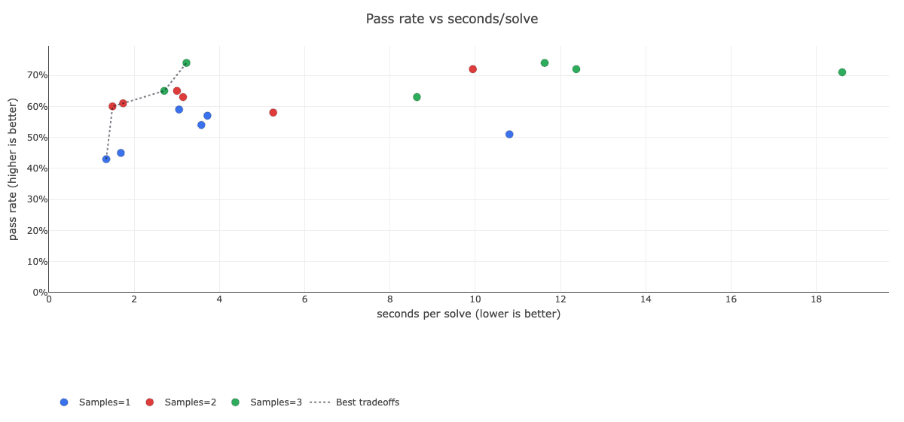
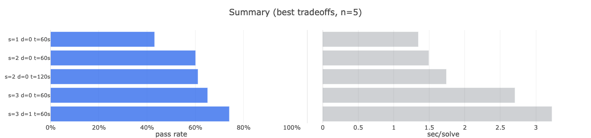
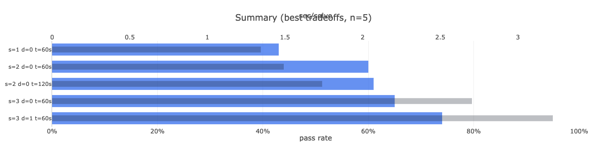

# Benchmarking Runbook (Local + OpenShift)

This is the canonical benchmarking doc for mCode.

## 1) Generate aggregate metrics

Use all shard DBs in a directory:

```bash
mcode results --db-dir ./results --benchmark mbpp --compare-samples --time
```

## 2) Generate interactive HTML report

```bash
mcode report --db-dir ./results --benchmark mbpp --out ./results/report.html
```

Open `./results/report.html` in your browser.

Note: the report loads Plotly from a CDN, so offline/blocked CDN means no charts.

## 3) Report metrics (speed)

- `sec/solve`: total wall-clock time / passed tasks
- `avg_s`: mean wall-clock seconds per attempted task
- `p95_s`: 95th percentile wall-clock seconds per attempted task
- `timed_out`: number of timed-out tasks in the shown set
- `timeout_rate`: timed-out tasks / total tasks

If your optimization target is pass rate + time-to-solve, use `sec/solve` as the default speed metric.

## 4) Report controls

- Top chart: pass rate vs `sec/solve` scatter, optional “Best tradeoffs (Pareto)” line.
- Bottom chart:
  - `Summary`: `best tradeoffs` or `all shown`
  - `Speed`: `sec/solve`, `avg_s`, `p95_s`
  - `View`: `split` or `overlay`
  - `Top`: row cap for readability
- Filters: each varying config field gets a compact multi-select dropdown.

## 5) OpenShift sweep (no RWX required)

The helper `deploy/k8s/oc_bench_sweep.py` runs indexed Jobs and copies each shard DB locally via `oc cp`.

Example sweep:

```bash
.venv/bin/python deploy/k8s/oc_bench_sweep.py \
  --benchmarks mbpp \
  --model granite4:latest \
  --samples 1,2,3 \
  --debug-iters 0,1,2 \
  --timeout 60,120 \
  --limit 100 \
  --shard-count 20 \
  --parallelism 2 \
  --env MCODE_MAX_NEW_TOKENS=1024
```

Then build the report from that output directory:

```bash
.venv/bin/mcode report --db-dir ./results/oc-sweep --benchmark mbpp --out ./results/oc-sweep/mbpp-sweep.html
```

If one sweep job fails late, already copied shard DBs remain usable. You can still run `mcode report` on the collected DBs.

## 6) Example screenshots







## 7) Research log

For durable benchmarking notes (plus a snapshot of the HTML report), store entries under `research/`.
See `research/README.md` for the template.
